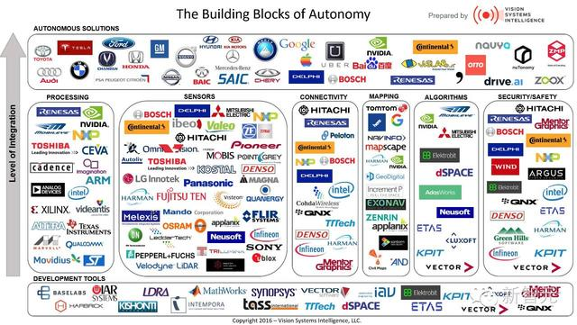
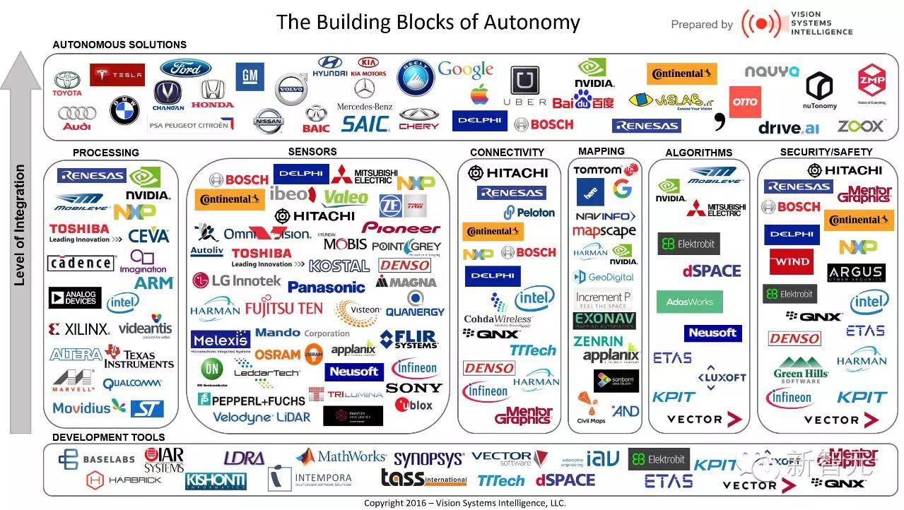
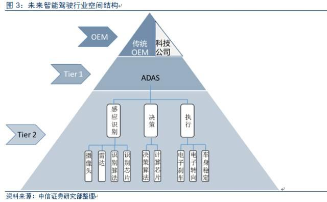
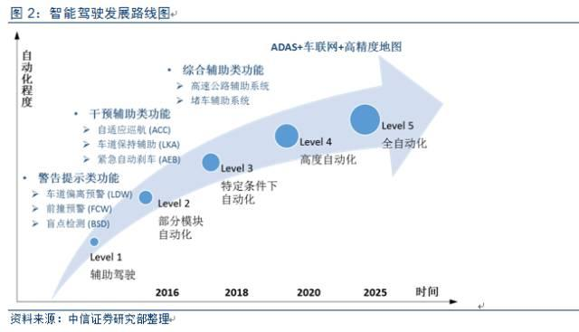
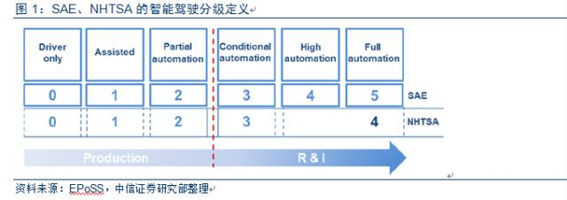
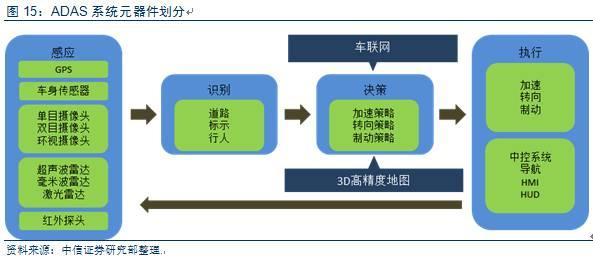
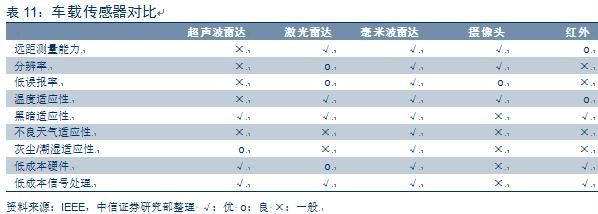
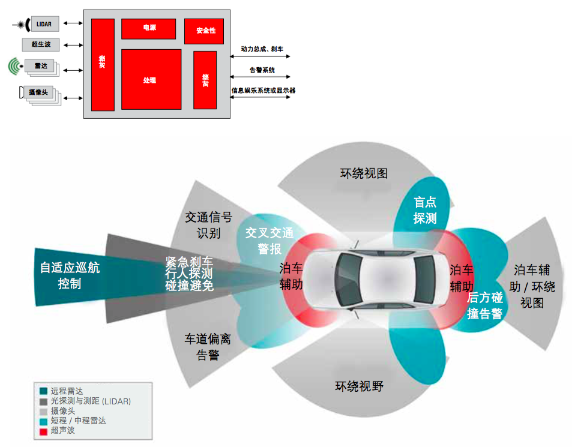
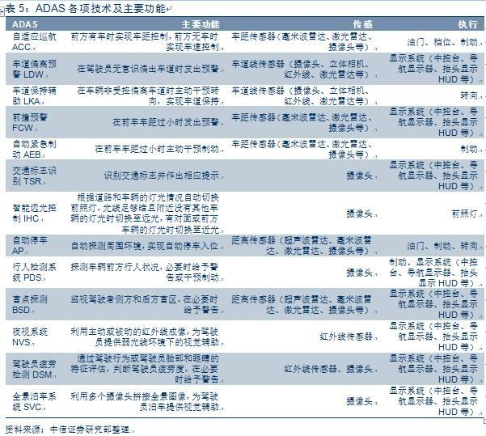

# 关于高级辅助驾驶系统 ADAS

感知、高精地图和驾驶决策是自动驾驶的三大支柱。需技术、立法、产业化同时推动。

## 2016 版图

技术研究公司 [VSI（Vision Systems Intelligence）](https://visionsystemsintelligence.com/)发布的自动驾驶产业布局图。

## 厂商

各类企业优势：

1. 科技型公司，数据融合、高精度地图技术优势，吸引消费者和资本市场关注；
2. 传统车企（OEM），掌握汽车生产资质和整车控制集成的核心竞争力，保留全产业链优势；
3. ADAS供应商，掌握感知识别算法，为车企和科技型公司提供ADAS系统解决方案；
4. 底层零部件供应商，如雷达、摄像头、芯片、电子刹车等。

### 代表

#### 科技型公司

**特斯拉**、**谷歌**、苹果、BAT、**Uber**

#### 传统车企（OEM）

- **奥迪**、**宝马**、奔驰、沃尔沃、**丰田**、马自达、福特等
- 通用、菲亚特克莱斯勒、本田、日产、三菱、富士重工业、现代、起亚、戴姆勒、大众、保时捷、玛莎拉蒂、捷豹路虎、特斯拉

- 长安 智能互联 SUV CS95，上汽 智能互联 SUV RX5、智能驾驶汽车 MG iGS

#### ADAS供应商

- **Bosch**、AutonomousStaff、Autoliy

- 和谐富腾、小鹏、蔚来、智车优行、乐视

#### 底层零部件供应商

#####  传感层：

- 摄像头：Omni、PointGrey、大恒和微视
- 雷达：Bosch、Denso、Delphi、博世、大陆、德尔福、电装、Velodyne、IBEO

##### 控制层：

- 芯片／软件：[Mobileye](http://www.mobileye.com/zh-cn)、[TI（德州仪器）](http://www.ti.com.cn/)、ADI、东芝、ST、飞思卡尔、**[NVIDIA](http://www.nvidia.cn/object/advanced-driver-assistance-systems-cn.html)**
- 集成控制：博世、大陆、德尔福、电装、[Mobileye](http://www.mobileye.com/zh-cn)
- 机器视觉算法：中科慧眼、地平线、东软和Minieye

- 高精地图：HERE、TOMTOM、RoadDNA、RoadBook、百度、高德、四维图新、武汉光庭

##### 执行层

- ESP/AEB/ABS等：博世、大陆、德尔福、电装

## 市场进度

模块化 ADAS 是传统汽车向无人驾驶进发的重要方式。

## 责权问题

智能驾驶按照汽车控制权及安全责任分配可分为不同级别。

美国机构有：国际自动机械工程师学会（SAE）、 美国国家公路交通安全管理局（NHTSA）和美国高速研究所（BASt）；中国机构 C-NCAP。

根据国际自动机械工程师学会（SAE）来分：

| 级别   |                |                                          |
| ---- | -------------- | ---------------------------------------- |
| 0    | 完全手动驾驶         |                                          |
| 1    | 辅助驾驶（警告提示类）    | **车道偏离预警LDW**、**前撞预警FCW**、**后视系统RVS**、**行人监测系统PDS**、**盲点监测BSD**、环视系统SVC、交通标示识别TSR等 |
| 2    | 部分模块自动化（干预辅助类） | **自适应巡航ACC**、车道保持辅助LKA、**紧急自动刹车AEB**、智能远光灯IHC、自动泊车AP等 |
| 3    | 特定条件下自动化（综合功能） | 丰田的公路自动驾驶辅助AHAC、特斯拉的自动巡航Autopilot、通用的Super Cruise |
| 4    | 高度自动化          | 奔驰概念车 F015 Luxuryin Motion，配备车联网、行人检测、自动紧急制动等功能 |
| 5    | 全自动化的无人驾驶      |                                          |

## 元器件

感知识别（主要为摄像头和雷达）和高精度地图系统。

## 关键技术

ADAS技术基础是计算机视觉。

### 行动层

- 转向、油门和制动三大控制器（及执行机构）：根据ECU输出讯号，让汽车完成动作之行

### 感知层

- 联网：车辆间以及车辆与基础设施间的互联网连接（数据云）
- 地图：存储和更新地理及基础设施信息
- 处理器（ECU/MCU）：处理决策所需的数据
- 感知单元：感知外部数据。包括毫米波雷达、激光雷达、摄像头、超声波雷达等
- 执行机构：根据计算结果快速动作。包括制动系统等

### 认知层

认知层主要是智能决策和规划，难点在于：**对环境的准确理解、对下一步决策的准确判断、选择合理的路径达到目标**。

- 程序算法：深度学习，计算机视觉和深度神经网络（DNN）管道
- 电子控制单元（ECU）

### 感知单元

雷达和摄像头会成为传感器主流，呈现多传感器融合趋势。

#### 基于摄像头的系统

单车保守用4个镜头（前置摄像＋两侧盲点监测＋后侧倒车影像）

使用范围：后备摄像头和环视系统等，驾驶员瞌睡告警、车道偏离告警和碰撞避免。

|              | 位置                | 应用                     |
| ------------ | ----------------- | ---------------------- |
| 单目摄像头        | 前挡风玻璃上部           | 自适应巡航、车道偏离预警、前撞预警、行人监测 |
| 后视摄像头        | 车尾                | 倒车可视系统                 |
| 立体摄像头（双目摄像头） |                   |                        |
| 环视摄像头        | 一般至少四个，分贝安装在车前后左右 | 自动泊车、全景泊车              |

#### 基于雷达的系统

目前主流车载传感器包括超声波雷达、激光雷达、毫米波雷达等

|                  | 位置                           | 应用                                       |
| ---------------- | ---------------------------- | ---------------------------------------- |
| 远程雷达系统（77GHz）    | 一般安装在车辆前部，侦测正前方。探测距离超过 100 米 | 车辆测距。通常用于自适应巡航控制、刹车辅助和碰撞告警               |
| 中程／近程雷达系统（24GHz） |                              | 短距车载雷达业务。盲点检测、侧面碰撞告警、两侧来车告警和变道辅助         |
| 光探测和测距（LIDAR）    |                              | 自适应巡航控制、事故避让与缓解以及目标探测。它对自主驾驶功能十分重要       |
| 超声波雷达            |                              | 用于泊车辅助已达到很高成熟度并为市场所广泛接受。片上系统是超声波传感器优选解决方案。 |
| 毫米波雷达            | 一般多个雷达组合                     | 车在距离探测，如自适应巡航、碰撞预警、盲区探测等                 |
| 激光雷达             |                              | 实施环境感知，三维建模                              |

#### 传感器融合

	

## 参考

1. [深度2016－2025 ADAS 技术及市场趋势报告](http://toutiao.com/i6297598292993769985/)
2. [报告│48张PPT看懂驾驶辅助系统（ADAS）市场现状](http://m.gzhphb.com/article/17/170084.html)
3. [【智驾深谈】Mobileye，用单目视觉点亮自动驾驶](http://mp.weixin.qq.com/s?__biz=MzI3MTA0MTk1MA==&mid=2651983140&idx=2&sn=54aee5f26fb4bdaad673dda9217672fb)