# 敏捷需求管理与发布规划

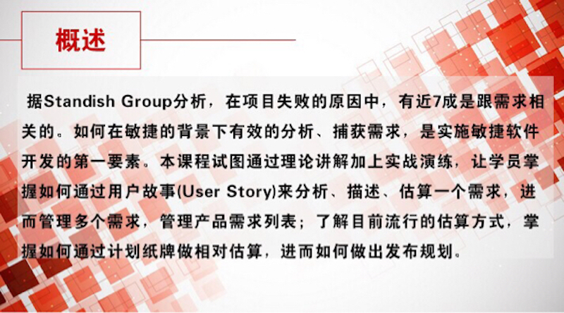

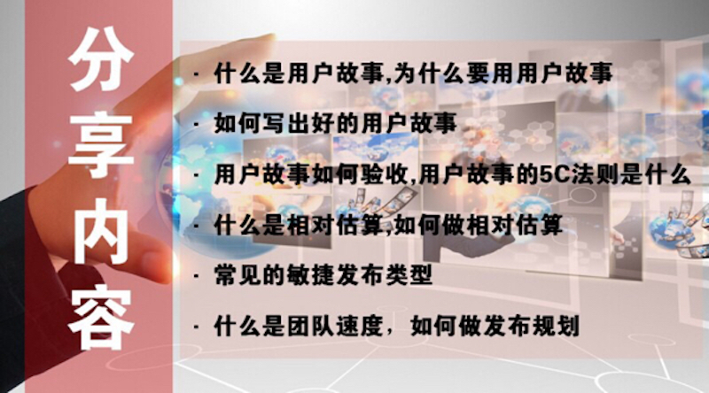

一个好的用户故事应该遵循 INVEST 原则：独立的(Independent)、可协调的(Negotiable)、有价值的(Valuable)、可估计的(Estimable)、短小的(Small)、可测试的(Testable)。

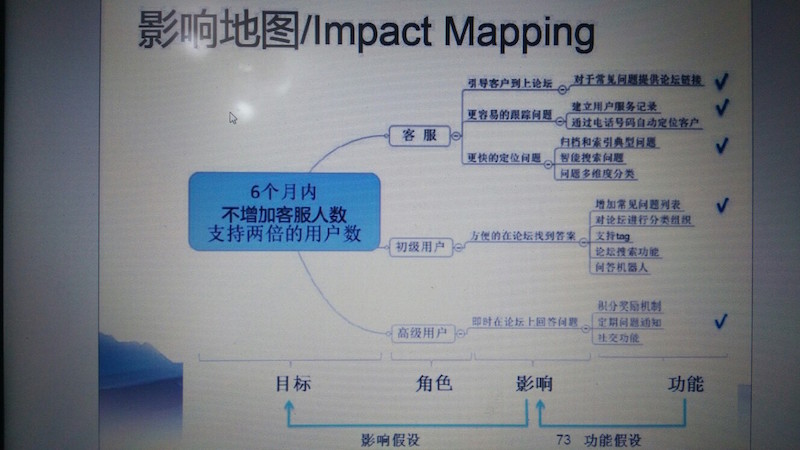

影响地图可视化了从业务目标到产品功能的映射关系。

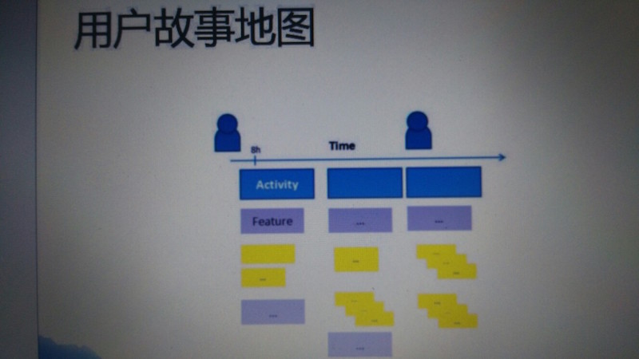

作为一个<角色>, 我想要<活动>, 以便于<商业价值>。

用户故事 5C 法则：

- Card（卡片，故事描述）
- Conversation（谈话，协作过程中与客户的对话）
-  Confirmation（确认，即验证条件）
- Construction(构建，开始构建、实现用户故事）
- Consequence(结果，实现用户故事后，可以展示的结果）

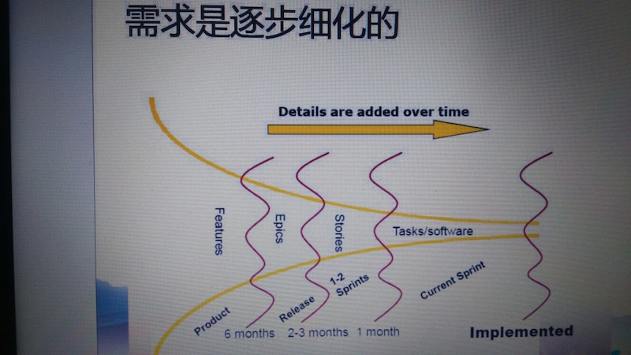

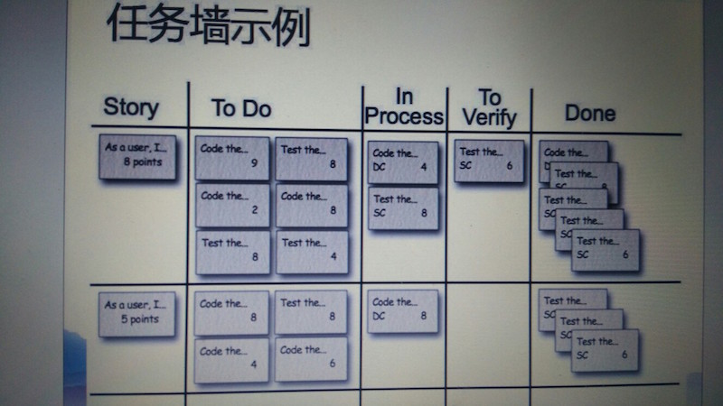

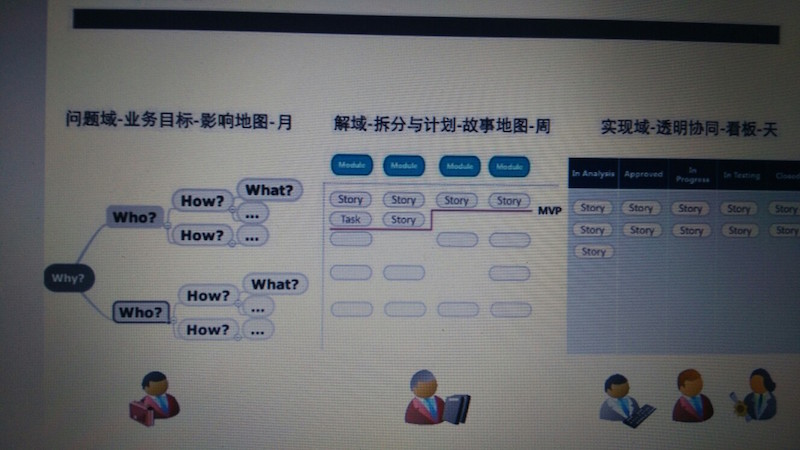

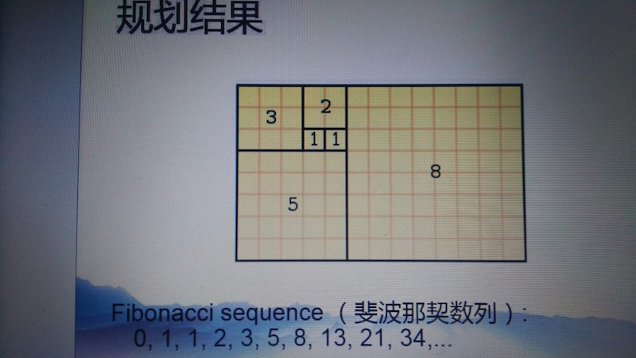

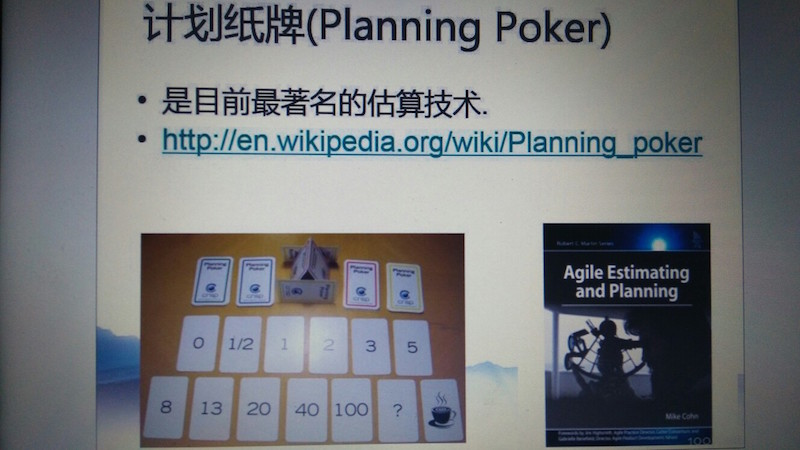

计划扑克（Planning Poker）是一个促使达成团队一致意见的团队构建活动。它由敏捷软件开发（agile software development）团队用来评估一定量的工作需要花多长时间完成。

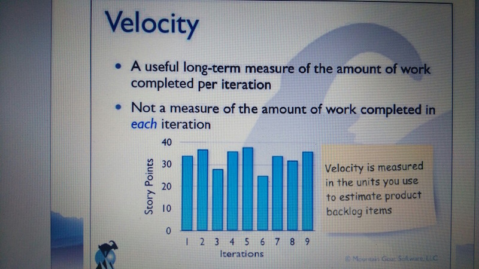

迭代速率（Velocity）与期望值管理。

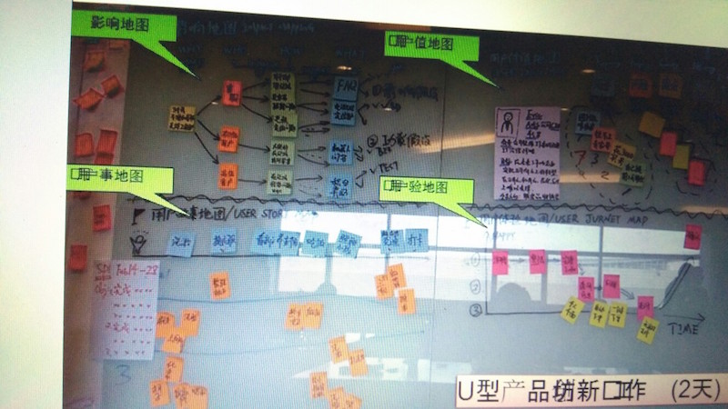

## 参考

- [解析精益产品开发（二）—— 产品开发中的价值](http://www.infoq.com/cn/articles/value-in-product-development)
- [产品Backlog的ODDE原则与用户故事的5C原则](http://bobjiang.com/index.php/2013/11/25/user_story_odde_5c/)
- [计划扑克](http://www.whatis.com.cn/word_5903.htm)
- [敏捷项目管理实战之进度管理](http://www.ibm.com/developerworks/cn/rational/r-cn-agileprojectprogressmanagement/)