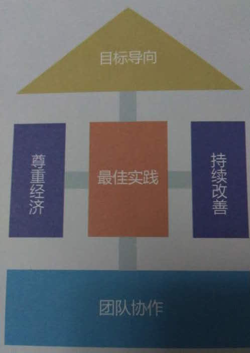

# 项目管理

[TOC]

> 2015年，PMI-ACP 认证引入中国；2016年，精益创业火了……
>
> Todo：先收集些资料，以后再补充个人思考的东西吧。

## PMP

- [几近满分的项目管理课程！内部30页PPT曝光](http://mp.weixin.qq.com/s?__biz=MzA5NDk4NDM0OA==&mid=405307453&idx=2&sn=64f6d0b0ea2b5f6022d05492884dcc1e)
- [光环国际远程 PMP 教育](http://bmov.aura.cn/index.html)
- [RELINK协作云app](https://www.relink.cc/)：（清华大学国际工 程项目管理研究院杨述的）一款专业的项目管理应用

## Agile敏捷

> 敏捷宣言：个体与互动高于流程和工具；工作的软件高于详尽的文档；客户合作高于合同谈判；响应变化高于遵循计划。
>
> 原则：我们最重要的目标，是通过持续不断地及早交付有价值的软件使客户满意。

### 敏捷导入

 

通过敏捷导入，找到真正痛点，从痛点找到问题的根源再引入相应的敏捷实践，包括XP、Scrum、Kanban等诸多实践工具箱 

#### 常见的典型问题

1. 我们的组织是否适合敏捷
2. 敏捷会给我们带了什么益处
3. 如何选取敏捷试点项目
4. 我们的团队敏捷成熟度如何
5. 团队不在同一地点工作怎么办
6. 我们的项目是传统模式与敏捷的混合，是否可以
7. 敏捷的人员角色、工作协作等方面有什么变化
8. 我们想做敏捷转型，如何开始

### SCRUM敏捷

#### 对象

研发总监、技术经理、项目经理、Scrum Master、PO、技术骨干和项目成员

#### 目标收益

- 了解如何使您的团队能更好地运作和协作
- 了解状态的卡的理念与构思，以及如何使用它们在不同的项目中
- 了解 Alpha，价值流映射，状态墙，可视化控制的概念
- 了解如何在各项敏捷的实践中（如 TDD、CI、情景驱动的开发、团队组织）评估并提升团队的能力

#### 内容

1. Scrum 介绍
2. 产品待开发项和用户故事
3. 迭代计划会

### 看板

#### 对象

从事产品研发的任何角色，包括部门经理、开发工程师、测试工程师、产品经理、过程改进工程师等

#### 目标收益

看板是管理知识工作的一种基于工作流的方法，源于精益原则。看板作为渐进式变革方法，可以帮助传统企业做平滑地敏捷转型

### 精益需求管理

#### 对象

需求分析人员、项目经理及项目管理（PMO）人员、高级开发与设计人员、高级测试工程师

#### 目标收益

- 分析业界公司在需求管理和需求开发过程中的误区，并分享成功经验
- 了解需求开发与需求管理的基本概念、基本框架和实施时的关键注意事项
- 了解需求开发和需求管理过程中各个角色的定位、职责、能力模型与任职资格
- 理解需求捕捉时的主要方法：用户故事、业务概念分析、最小原型法
- 理解需求分析、需求建模的主流方法
- 理解非功能的分类、示例以及如何获取的方法
- 掌握规格化需求时的注意事项与模版示例
- 了解需求评审时的3种常用的方法：正规检视、同行专家评审与走查
- 了解需求变更控制的流程、要素与注意事项

#### 内容

1. 需求调研
2. 需求分析、需求建模与需求规格化
3. 需求的分解与跟踪
4. 需求的评审与确认
5. 需求变更管理的流程

### 敏捷测试

#### 对象

软件测试/开发工程师、一线管理人员及项目经理等

#### 目标收益

- 了解敏捷测试与探索式测试
- 做好敏捷测试的工作量评估与任务分解
- 掌握敏捷测试中的思考方法和关键技能
- 了解单元测试和持续集成，熟练运用自动化方法提高测试效率
- 如何更好的与团队不同成员一起工作提高软件质量

#### 内容

1. 敏捷开发与敏捷测试
2. 敏捷测试过程
3. 自动化与持续集成
4. 探索式软件测试

### 敏捷落地

#### 对象

项目经理、产品经理、开发团队的管理者、企业敏捷转型的引导者和决策者，同时适合整个开发团队

#### 内容

##### 敏捷需求

- 使用精益产品画布获取用户真实需求，与用户更好的沟通
- 制定软件开发交付计划
- 书写“活”的用户需求文档
- 利用ATDD将需求、测试和开发结合在一起

##### 迭代开发框架（Scrum ＋ XP ＋ Kanban）

- 分解产品故事、冲刺故事以及任务；用户故事的估算方法
- 制定迭代计划；并规划会议（迭代启动会议、站立式工作会议、演示会议）
- 看板方法和“故事墙”的核心实践
- 使用WIP和TOC优化流程，利用可视化管理解决“棘手”问题

##### 敏捷落地之道

- 思想篇：帮助团队成员正确认识敏捷本质，从而组织真正的自组织团队
- 方法篇：如何让敏捷团队真正落地？针对团队开发中常见问题，敏捷工具库中有哪些工具可以帮助我们？
- 实践篇：如何让敏捷实践真正作用于团队？实施中可能出现的问题及有哪些注意事项？

### 软件架构

#### 对象

一般软件企业的设计人员和初级架构师，资深程序员

#### 内容

1. 软件架构文档和架构视图
2. 软件架构设计关注点
3. 软件架构设计过程
4. 软件架构应用
5. 软件架构应用类型和参考架构
6. 软件架构模式应用
7. 软件架构的实现
8. 软件架构核心策略 

### 一些分享

- [敏捷需求管理与发布规划(20160428)](agile-aura-20160428.html)
- [创新时代下的敏捷项目管理(20160605)](agile-aura-20160605.html)
- [如何拯救你的产品？产品规划VS敏捷创新(20160630)](https://mp.weixin.qq.com/s?__biz=MzIyMDQzODIyNA==&mid=2247483778&idx=1&sn=5ee9a409761f33a886643caae5dd9e33)