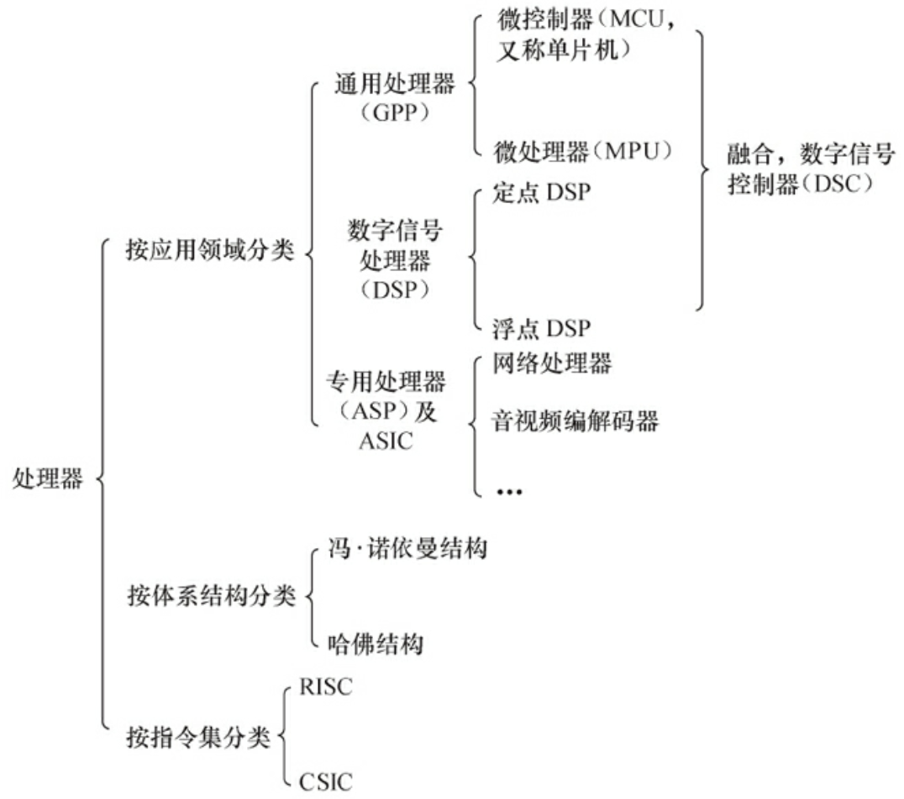
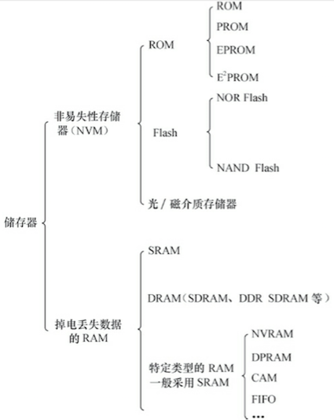

## 硬件基础

### 处理器

### 存储器

### 常见外设接口与总线工作方式

1. UART (串口)
2. I2C（内置集成电路）
3. SPI（串行外设接口）
4. USB（通用串行总线）
5. 以太网接口
6. PCI（外围部件互连） 和 PCI-E
7. SD 和 SDIO
8. CPLD（复杂可编程逻辑器件）和 FPGA（现场可编程门阵列） 

### 调试常用仪器仪表

- 万用表：测量电平、使用二极管测量电路板上网络的连通性
- 示波器
- 逻辑分析仪