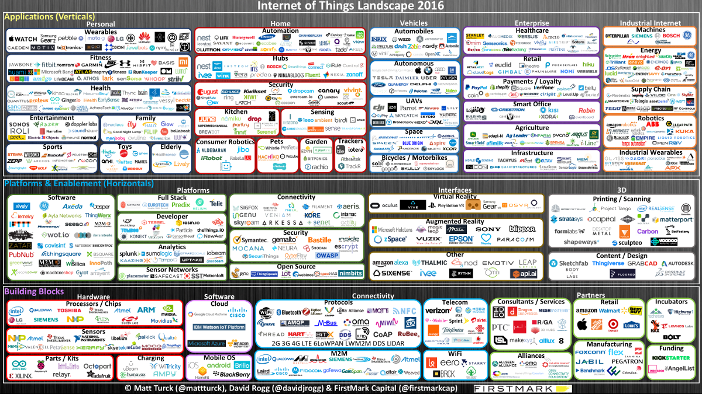
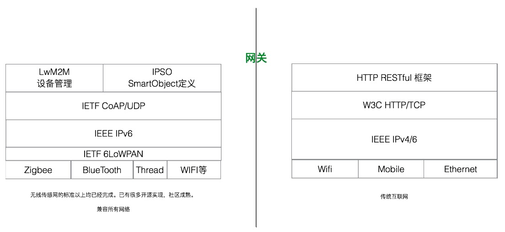

# 从互联网到物联网

## 2016年物联网版图

*[全尺寸版图](http://mattturck.com/wp-content/uploads/2016/03/Internet-of-Things-2016.png)和[完整的公司列表](http://dfkoz.com/iot-landscape/)见链接。*

## 演变

### Web 1.0 时代

- WWW 由三部分组成：URL、HTTP、HTML。
- 好处：免费、无状态、自带格式
- HTTP 1.1 超文本传输协议

### Web 2.0 时代

广泛运用于 API 设计的 REST

### 移动互联网时代

本地处理，云端 Sync 的面向资源的原生技术架构。通常采用类 ActiveSync 架构，利用 Http 取增量数据

### HTML 5时代

- 从标记语言到 Web Application
- 本地处理，云端 Sync 的面向资源的 HTML 5 技术架构

### 物联网时代

**定义：**

国际组织定义中的“物联网”、“传感网”，特指小型低功耗设备组成的网络。

**特征：**

- 比移动互联网更加艰巨的是网络可靠性更差、设备性能更低
- 省电和休眠是常态
- IETF 物联网的 CoAP（受限网络协议）借鉴于 REST

## 互联网与物联网区别

|      | 简介                                       | 意义           | 关键技术                 |
| ---- | ---------------------------------------- | ------------ | -------------------- |
| 互联网  | 解决信息共享、交互。连接了人和信息内容，提供标准化服务。             | 把卖产品变为卖内容和服务 | 大数据、云计算、商业智能         |
| 物联网  | 通过通信技术（射频识别 RFID），把传感器（红外感应、全球定位、激光扫描）、控制器、机器、人员和物联在一起。 |              | 传感器技术、RFID标签、嵌入式系统技术 |

## 物联网技术

### 硬件层

嵌入式处理技术：传感器、控制器、执行器

### 应用程序层

终端技术：终端、浏览器/客户端、移动设备

### 服务层

- 网络技术：应用程序、MQTT、HTTP、CoAP
- 无线技术：NB-IoT(基于蜂窝的窄带物联网)、Bluetooth 5.0

### 协调层（可选）

协调设备

## 参考

- 野狗的 “面向资源架构设计”
- [phodal/lan](https://github.com/phodal/lan)：一个开源的物联网平台
- [html5 时代](../html/html5.html)
- [RESTful 的 CoAP 协议](http://www.ituring.com.cn/tupubarticle/3795)