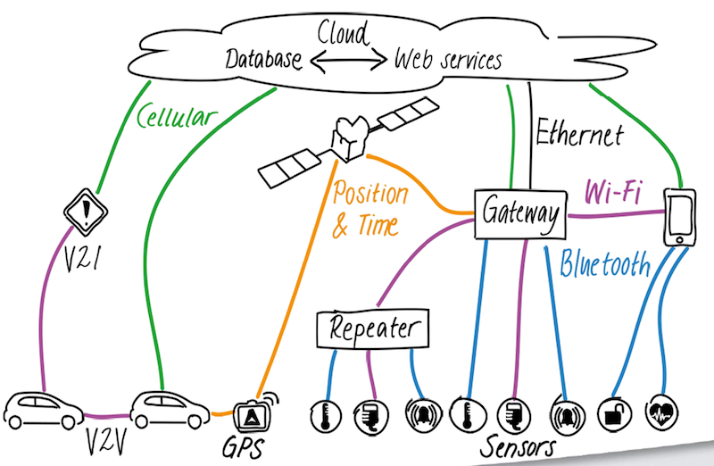

# WoT 与 IoT

[TOC]

> 目前，物联网系统主要有两种架构：传统垂直领域 “无线传感器网/IoT” 和基于 Web 技术 “Web Service/SOA” 的 WOT 。WoT 优势在于开放、成本，适用于有成本压力、业务丰富的场景；而传统 “无线传感器网/IoT” 适合高安全性、高实时的场景。

## 物联网连接方案

## 物联网的研发

> 值得注意的是，机制和策略分离。它们看似相近的领域，实则不同。

### ruff.io

Ruff 开发有三个层次：应用开发（不用了解硬件）、驱动开发（能够阅读外设的数据手册）、板卡开发（能够根据数据手册，编写板卡配置）。

Ruff 是一个敏捷开发智能硬件的系统平台。它包含 Ruff SDK、Ruff OS，Rap Registry 等。

- Ruff SDK 工具集，拥有 Rap、Debugger、Console、Simulator 等多种开发工具。
- Ruff OS 兼容多个平台的运行环境，它支持嵌入式 Linux， MCU 单片机领域等。它让您不用关心底层硬件类型，只集中注意力在应用逻辑上，根据您的应用需要消耗的资源选取相应硬件平台。
- Rap Registry 一个寻找、使用、提交驱动、库，框架等代码的代码共享平台。它可以让开发者大量重复使用已有的代码，避免重复开发的浪费，提升开发效率。

#### 参考

官方

1. [Ruff官网](https://ruff.io/zh-cn/)
2. [ruff-drivers](https://github.com/ruff-drivers)：官方驱动
3. [ruff-standard](https://github.com/ruffjs/ruff-standard)：Ruff 代码风格
4. [ruff-issues](https://github.com/ruffjs)：Ruff Issues is a issue collector for Ruff
5. [Ruff 和 Raspberry Pi 的区别是什么？](https://mp.weixin.qq.com/s?__biz=MzI4NjA2MTQwNQ==&mid=2247483716&idx=1&sn=95fb8869e7107677b294a410aeb9fa92)

工具

1. [RuffHelper](https://github.com/runinspring/ruffhelper)：Ruff 开发辅助工具，把常用的 rap 命令可视化操作
2. [ruff-t](https://github.com/vilic/ruff-t)：T (Testing Framework) for Ruff
3. [rvm](https://github.com/vilic/rvm)：Ruff Version Manager
4. [ruff-fetch](https://github.com/vilic/ruff-fetch)：A simplified version of `window.fetch` written for Ruff
5. [ruff-promise](https://github.com/vilic/ruff-promise)：ES6 Promise for Ruff ([https://ruff.io](https://ruff.io/)) based on ThenFail v0.4 ([https://github.com/vilic/thenfail](https://github.com/vilic/thenfail)).

应用

1. [ruff-menu](https://github.com/vilic/ruff-menu)：Awesome Menu for Ruff LCD (lcd1602)
2. [ruff-home](https://github.com/vilic/ruff-home)：Home (Web Framework) for Ruff
3. [RuffApps](https://github.com/RuffApps/Apps)：一些 Ruff 应用
4. [devices.ruff](https://github.com/lerencao/devices.ruff)：Testing devices like button, buzzer, temperature sensor, and lcd

### Jetson TX1 and Jetson TK1

NVIDIA Jetson TX1是首款针对深度学习神经网络设计的嵌入式超级计算机，其上一代产品Jetson TK1于NVIDIA GTC 2014上亮相。

1. [NVIDIA 中国官网](http://www.nvidia.cn/page/home.html)
2. [NVIDIA 嵌入式计算教程(OpenCV101/VisionWorks/Developer Tools)](https://developer.nvidia.com/embedded/learn/tutorials)
3. [Linux For Tegra](https://developer.nvidia.com/embedded/develop/software)
4. [JetPack for L4T](https://developer.nvidia.com/embedded/jetpack)

#### 库

##### CUDA

1. [CUDA TOOLKIT DOCUMENTATION](http://docs.nvidia.com/cuda/)
2. [CUDA Zone 中国](https://cudazone.nvidia.cn/)
3. [CUDA Toolkit 下载](https://developer.nvidia.com/cuda-toolkit)

##### VisionWorks

1. [VisionWorks](https://developer.nvidia.com/embedded/visionworks)：计算机视觉（CV）和图像处理的软件开发包
2. [workshop 视频：introduction](https://www.brainshark.com/nvidia/vwa-introduction)
3. [workshop 视频：simple CV tasks with Vision Works](https://www.brainshark.com/nvidia/vwb-simplecv)
4. [OpenVX](https://www.khronos.org/openvx/)

##### OpenCV

1. [OpenCV](http://opencv.org/)：开源计算机视觉库

##### 开发工具

- [Tegra Graphics Debugger](https://developer.nvidia.com/tegra-graphics-debugger)：控制台级调试工具
- [Tegra System Profiler](https://developer.nvidia.com/tegra-system-profiler)：多核 CPU 采样分析器
- [PerfKit](https://developer.nvidia.com/nvidia-perfkit)：帮助调试和配置 OpenGL 和 Direct3D 应用程序的性能工具

#### Jetson TK1

1. [NVIDIA  Jetson TK1 学习与开发](http://blog.csdn.net/frd2009041510/article/details/41901239)
2. [Jetson TK1的一些事项](jetson-tk1.html)
3. [Jetson TK1 Tegra K1 摄像头 MIPI CSI-2 模块 OV5640](scam-tk1.html)
4. [Jetson TK1 挂载 SanDisk 128G SD 卡](sd-tk1.html)
5. [Jetson TK1 麦克风 SONY ECM-DS70P 模块](microphone-tk1.html)

#### Jetson TX1

1. [JetsonHacks](http://jetsonhacks.com/)

#### 参考

1. [Midnight Commander (MC)](https://github.com/MidnightCommander/mc)：文件管理
2. [CMake](https://github.com/Kitware/CMake)：跨平台的安装（编译）工具
3. [Linux 内核](./linux-kernel.html)
4. [Ubuntu armhf 源](ubuntu-armhf-sources.html)
5. [Elinux Jetson TK1](http://elinux.org/Jetson_TK1)
6. [爱奇艺 Jetson TK1 教程](http://so.iqiyi.com/so/q_Jetson%20TK1)
7. [Jetson TK1 介绍与配置](http://ziyangli.github.io/2014/12/20/jetsontk1/)

## 附录

- [关于高级辅助驾驶系统 ADAS](adas.html)
- [VRSE](http://vrse.com)：一家虚拟现实（VR）app 的公司
- [Web of Things (WoT)](../html/wot.html)
- [互联网与物联网](../html/int-iot.html)
- [The Internet of Things : beyond the hype](https://recherche.orange.com/en/the-internet-of-things-beyond-the-hype/)
- [物联网世界的前端开发](http://www.zcfy.cc/article/front-end-development-in-an-internet-of-things-world-843.html)
