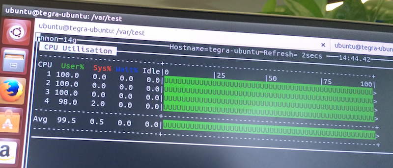

# Linux 压力测试 stress

[TOC]

Stress是一个Posix系统下 Cpu/Menory/IO/Disk 压测工具。

以 Nvidia Jetson TK1、Ubuntu 14.04、[**stress-1.0.4.tar.gz**](http://people.seas.harvard.edu/~apw/stress/stress-1.0.4.tar.gz) 环境为例，检测开发板 CPU 在 100% 情况下的温度。

建议 root 或 sudo 执行：

## 压测并测量 CPU 温度

### 准备

需运行良好的 Nvidia Jetson TK1 和 红外测温仪。


### 安装

1. 下载 [stress](http://people.seas.harvard.edu/~apw/stress/)。

2. 将 stress-1.0.4.tar.gz 复制到 `／usr/local/src` 目录下

3. 执行以下命令

   ```shell
   cd /usr/local/src
   tar -xzpvf stress-1.0.4.tar.gz
   cd stress-1.0.4
   ./configure
   make
   make check
   make install
   make clean
   ```

### 执行压测

1. 创建测试目录

   ```shell
   cd /var
   mkdir test
   cd test
   ```

2. 执行压测（产生4个进程，每个进程都反复不停计算由 rand() 产生随机数的平方根）

   ```shell
   stress -c 4
   ```

### 查看 CPU 情况

通常 `top` 命令即可，但非常建议用 `nmon` 或  `htop`。

1. 同时按 `Ctrl ＋ Shift ＋ T` ，打开新 Terminal 选项卡

2. 执行`nmon`命令后，按 `c`，查看 CPU 占用

   

### 测量板子CPU模块温度

1. 持续压测约 10 分钟
2. 用红外温度测量仪获取 CPU 温度

## 其它

### 磁盘占满问题

1. `df`命令，查看 `/var` 是否已满，如磁盘已满 “stress” 会报错并终止。

2. 清空测试目录并重新运行

   ```shell
   cd
   chmod -R 755 /var/test
   rm -R -f /var/test/
   cd /var/test/
   stress -c 4
   ```

### 卸载 stress

执行以下命令清理 stress

```shell
rm -R -f /usr/local/src/stress-1.0.4
rm -f /usr/local/bin/stress
rm -f /usr/local/src/stress-1.0.4.tar.gz
```
### stress 常用参数解析

 `stress -?` 查看参数

- -t ：指定运行N秒后停止
- -c：产生n个进程 每个进程都反复不停的计算随机数的平方根
- -i：产生n个进程，每个进程反复调用sync()，sync()用于将内存上的内容写到硬盘上
- -m：产生n个进程，每个进程不断调用内存分配malloc和内存释放free函数
- -d：产生n个执行write和unlink函数的进程

#### 示例

产生8个cpu进程、4个io进程、2个128M的malloc()/free()进程，1分钟后停止运行

```shell
stress -c 8 -i 4 -m 2 --vm-bytes 128M -t 1m
```

- 测试硬盘，通过mkstemp()将 1GB 大小的文件写入当前目录，并执行 unlink() 清除。注： `--hdd-bytes` 默认是 1GB

```shell
stress -d 1
```

### 锁定 CPU 频率至最高(2320500)

1. 锁频

   ```shell
   ### Maximize CPU performance
   echo 0 > /sys/devices/system/cpu/cpuquiet/tegra_cpuquiet/enable
   echo 1 > /sys/devices/system/cpu/cpu0/online
   echo 1 > /sys/devices/system/cpu/cpu1/online
   echo 1 > /sys/devices/system/cpu/cpu2/online
   echo 1 > /sys/devices/system/cpu/cpu3/online
   echo performance > /sys/devices/system/cpu/cpu0/cpufreq/scaling_governor
   ```

2. 在 home 目录创建 cpu_freq.sh

   ```shell
   cd ~
   vim cpu_freq.sh
   ```

   内容：

   ```shell
   echo "cpu0"
   cat /sys/devices/system/cpu/cpu0/cpufreq/cpuinfo_max_freq
   echo "cpu1"
   cat /sys/devices/system/cpu/cpu1/cpufreq/cpuinfo_max_freq
   echo "cpu2"
   cat /sys/devices/system/cpu/cpu2/cpufreq/cpuinfo_max_freq
   echo "cpu3"
   cat /sys/devices/system/cpu/cpu3/cpufreq/cpuinfo_max_freq
   ```

3. `:x` 保存后，更改  cpu_freq.sh 权限

   ```shell
   sudo chmod +x cpu_freq.sh
   ```

4. 查看 cpu 频率

   ```shell
   ./cpu_freq.sh // 或 watch ./cpu_freq.sh
   ```

### GPU 相关

```shell
### GPU performance
echo 852000000 > /sys/kernel/debug/clock/override.gbus/rate
echo 1 > /sys/kernel/debug/clock/override.gbus/state

### GPU memory clock
echo 924000000 > /sys/kernel/debug/clock/override.emc/rate
echo 1 > /sys/kernel/debug/clock/override.emc/state
```

## 参考

1. [linux压力测试软件stress命令操作与使用指南](http://blog.sina.com.cn/s/blog_5f50a4c80101pdik.html)
2. [Linux压力测试软件Stress使用指南](http://www.weixinduba.com/n/133741)
3. [linux压力测试工具stress](http://www.cnblogs.com/javaee6/p/4642744.html)
4. [L4T 21.4 Jetson - Maximizing CPU performance in rc.local - scaling_governor is not setting](https://devtalk.nvidia.com/default/topic/886502/l4t-21-4-jetson-maximizing-cpu-performance-in-rc-local-scaling_governor-is-not-setting/)