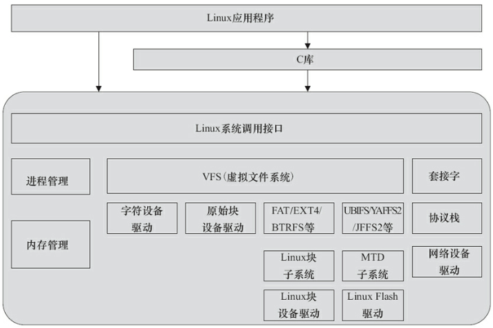
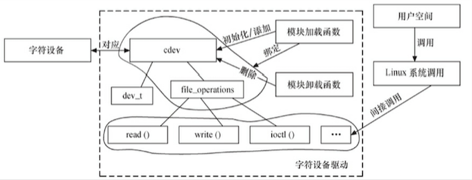

#  Linux 驱动开发

## 概念

Linux 设计中强调的一个基本观点是：机制和策略分离。因此，驱动应是对策略透明的。

|      | 功能         | 运行空间 | 特征   | 一般场景 |
| ---- | ---------- | ---- | ---- | ---- |
| 策略   | 处理如何使用这些能力 | 用户空间 | 灵活   | 应用   |
| 机制   | 解决提供什么能力   | 内核空间 | 相对稳定 | 驱动   |

### 设备驱动与整个软硬件系统的关系

Linux 用户空间的文件编程有两种方法，即通过 Linux API 和 通过 C 库函数访问文件。

## 驱动分类

- 字符设备：按键、键盘、触摸屏、USB、鼠标等
- 块设备：硬盘、eMMC等
- 网络设备：

## 驱动开发

Linux 内核中增加程序需要完成以下3项工作：

1. 将编写的源代码复制到 Linux 内核源代码的相应目录
2. 在目录的 Kconfig 文件中增加关于新源代码对应项目的编译配置选项
3. 在目录的 Makefile 文件中增加对新源代码的编译条目

## 编程风格

- [Documents/CodingStyle](http://lxr.free-electrons.com/)
- [scripts/checkpatch.pl](scripts/checkpatch.pl)：检查代码风格是否符合 CodingStyle
- 工程阶段，一般可以在 SCM 软件的服务器端用 pre-commit hook，自动检查工程师提交的代码是否符合 Linux 的编码风格，如果不符合，则自动拦截

### 字符设备驱动

#### cdev 结构体

- register_chrdev_region() 或 alloc_chrdev_region() 向系统申请设备号
- cdev_add() 向系统注册字符设备
- cdev_del() 从系统注销字符设备
- unregister_chrdev_region() 释放已申请的设备号

#### file_operations 结构体

## 设备驱动的分层思想

1. 输入设备驱动
2. RTC 设备驱动
3. Framebuffer 设备驱动
4. 终端设备驱动
5. misc 设备驱动

## 附录

建议 “微信读书” 王宝华的《Linux 设备驱动开发详解：基于最新的 Linux 4.0 内核》
1. [Ubuntu 的 VirtualBox 镜像](https://pan.baidu.com/s/1o8ncCSa) (提取码 m7g5)。系统中 账号、密码 "baohua"
2. [Linux Cross Reference](http://lxr.free-electrons.com/)：Linux内核源码的交叉索引
3. minicom：串口通信工具
4. [Linux Device Drivers 3 examples](https://github.com/martinezjavier/ldd3)
5. [LinuxQuestions](https://www.linuxquestions.org/)
6. [Linux Kernel Newbies](http://kernelnewbies.org/LinuxVersions)：Linux 每个版本具体变更
7. [Linux Weather Forecast](http://www.linuxfoundation.org/news-media/lwf)：Linux 近期热点和走向
8. [Linux 内核](./linux_kernel.html)
9. [硬件基础](./hardware.html)