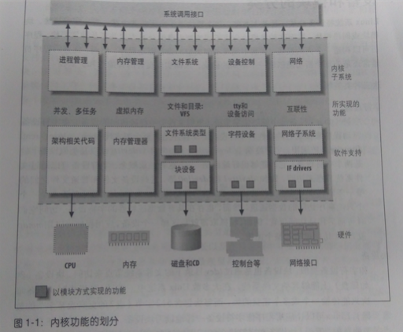

#  

## 概念

机制，解决提供什么能力；策略，处理如何使用这些能力。一般，驱动属于机制范畴；应用归于策略范畴。

#### （对策略透明的）驱动分类

- 字符设备（open、close、read、write）：触摸屏、USB、鼠标等
- 块设备：硬盘、eMMC等
- 网络接口：

## 内核划分



## 设备驱动与整个软硬件系统的关系


## 内核的组成部分


## 内核源代码目录结构

| 目录、文件          | 说明                                       |
| -------------- | ---------------------------------------- |
| Documentation/ | 内核各部分的通用解释和注释                            |
| arch/          | 和硬件体系结构相关                                |
| block/         | 块设备驱动程序 I/O 调度                           |
| certs/         |                                          |
| crypto/        | 常用加密和散列算法（如 AES 、 SHA 等），还有一些压缩和 CRC 校验算法 |
| drivers/       | 设备驱动程序                                   |
| firmware/      |                                          |
| fs/            | 支持的各种文件系统                                |
| include/       | 头文件                                      |
| init/          | 内核初始化代码                                  |
| ipc/           | 进程间通信代码                                  |
| kernel/        | 内核部分，包括进程调度、定时器等，而和平台相关的部分在 arch/*/kernel/ |
| lib/           | 库文件                                      |
| mm/            | 内存管理，和平台相关部分在 arch/*/mm/                 |
| net/           | 网络相关，实现各种网络协议                            |
| samples/       |                                          |
| scripts/       | 用于配置内核的脚本文件                              |
| security/      | 主要是 SELinx 模块                            |
| sound/         | ALSA 、OSS 音频设备驱动核心代码和常用设备驱动              |
| tools/         |                                          |
| usr/           | 实现用于打包和压缩的 cpio 等                        |
| virt/          |                                          |
| COPYING        |                                          |
| CREDITS        |                                          |
| Kbuild         | 内核的编译系统                                  |
| Kconfig        | 给用户提供配置选择的功能                             |
| MAINTAINERS    |                                          |
| Makefile       | 定义 Linux 内核编译规则                          |
| README         |                                          |
| REPORTING-BUGS |                                          |

## 内核的编译

推荐 `make menuconfig`

- Makefile
- 配置文件（Kconfig）
- 配置工具

## 驱动开发

Linux 内核中增加程序需要完成以下3项工作：

1. 将编写的源代码复制到Linux内核源代码的相应目录
2. 在目录的 Kconfig 文件中增加关于新源代码对应项目的编译配置选项
3. 在目录的 Makefile 文件中增加对新源代码的编译条目

## 编程风格

- [Documents/CodingStyle](http://lxr.free-electrons.com/)
- [scripts/checkpatch.pl](scripts/checkpatch.pl)：检查代码风格是否符合 CodingStyle
- 工程阶段，一般可以在 SCM 软件的服务器端用 pre-commit hook，自动检查工程师提交的代码是否符合 Linux 的编码风格，如果不符合，则自动拦截

## 内核模块程序结构

### 模块加载函数：

- insmod(或modprobe) 模块名参数名=参数值。运行时，应使用逗号分隔输入的数组元素

- 一般以 __init 标识声明
- 以 “module_init” 形式指定。成功返回 0，失败则返回错误编码（在 <linux/errno.h> 中定义）
- 可使用 request_module(module_name) 加载其它内核模块
- 只是初始化阶段需要的数据，也可被定义为 __initdata

### 模块卸载函数：

- rmmod 模块名参数名
- 一般以 __exit 标识声明
- 以 “module_exit” 形式指定。成功返回 0，失败则返回错误编码（在 <linux/errno.h> 中定义）
- 只是退出阶段采用的数据，可被定义为 __exitdata

### 模块许可证声明：

- GPL、GPL v2、GPL and additional rights、Dual BSD/GPL、Dual MPL/GPL 和 Proprietary


### 模块参数（可选）

-   可用 “module_param(参数名, 参数类型, 参数读/写权限)” 为模块定义一个参数
-   参数类型可以是 byte、short、short、int、uint、long、ulong、sharp、bool 或 invbool
-   模块也可拥有参数数组，形式 "module_param_array (参数组名, 数组类型, 数组长, 参数读/写权限)"


### 模块导出符号（可选）

- 可使用宏 EXPORT_SYMBOL(符号名) 、EXPORT_SYMBOL_GPL(符号名) 导出符号到内核符号表中

### 模块声明与描述（可选）

- MODULE_AUTHOR
- MODULE_DESCRIPTION
- MODULE_VERSION
- MODULE_DEVICE_TABLE
- MODULE_ALIAS

### 模块的使用计数

- try_module_get (&module) ：增加模块使用计数。0表示调用失败
- module_put (&module) ：减少模块使用计数。

### 模块的编译

- Makefile

- 一个模块包括多个 .c 文件，则 Makefile 中 

  ```c++
  obj-m := module name.o

  modulename-objs := file1.o file2.o
  ```

## 文件系统与设备文件

### 文件操作系统调用

#### 创建

```c
int creat(const char *filename, mode_t mode);
```

参数  `mode` 指定新建文件存取，同 `umask` 一起决定文件最终权限

#### 打开

```c
int open(const char *pathname, int flags);
```

#### 读写

```c
int read(int fd, const void *buf, size_t length);
int write(int fd, const void *buf, size_t length);
```

#### 定位

```c
int lseek(int fd, offset_t offset, int whence);
```

- whence：SEEK_SET、SEEK_CUR、SEEK_END

#### 关闭

```c
int close(int fd);
```

### C 库文件操作

#### 创建和打开

```c
FILE *fopen(const char *path, const char *mode);
```

#### 读写

```c
int fgetc(FILE *stream);
int fputc(int c, FILE *stream);

char *fgets(char *s, int n, FILE *stream);
int fputs(const char *s, FILE *stream);

int fprintf(FILE *stream, const char *format, …);
int fscanf(FILE *stream, const char *format, …);

size_t fread(void *ptr, size_t size, size_t n, FILE *stream);
size_t fwrite(const void *ptr, size_t size, size_t n, FILE *stream);
```

#### 定位

```c
int fgetpos(FILE *stream, fpot_t *pos);
int fsetpos(FILE *stream, const fpos_t *post);
int fseek(FILE *stream, long offset, int whence);
```

#### 关闭

```c
int fclose(FILE *stream);
```

### 文件系统目录结构

Linux 根目录（即 “/”）

| 目录    | 说明                                      |
| ----- | --------------------------------------- |
| /bin  | 基本明命令， ls、cp、mkdir 等                    |
| /sbin | 系统命令，mod probe、hwclock、ifconfig 等       |
| /dev  | 设备文件存储目录                                |
| /etc  | 系统配置文件                                  |
| /lib  | 系统库文件存放                                 |
| /mnt  | 挂载存储设备等挂载目录                             |
| /opt  | 有些软件包安装位置                               |
| /proc | 操作系统运行时，进程及内核信息存放。伪文件系统 proc 挂载目录，存在于内存 |
| /tmp  | 临时文件                                    |
| /usr  | 存放程序目录，如用户命令、用户库等                       |
| /var  | 存放系统日志等                                 |
| /sys  | sysfs 文件系统映射目录                          |

## 硬件基础

### 处理器


### 存储器


### 常见外设接口与总线工作方式

- 串口
- I2C（内置集成电路）
- SPI（串行外设接口）
- USB（通用串行总线）
- 以太网接口
- PCI（外围部件互连） 和 PCI-E
- SD 和 SDIO
- CPLD（复杂可编程逻辑器件）和 FPGA（现场可编程门阵列） 

### 调试常用仪器仪表

- 万用表：测量电平、使用二极管测量电路板上网络的连通性
- 示波器
- 逻辑分析仪

## 附录

建议 “微信读书” 王宝华的《Linux 设备驱动开发详解：基于最新的 Linux 4.0 内核》
1. [Ubuntu 的 VirtualBox 镜像](https://pan.baidu.com/s/1o8ncCSa) (提取码 m7g5)。系统中 账号、密码 "baohua"
2. [Linux Cross Reference](http://lxr.free-electrons.com/)：Linux内核源码的交叉索引
3. minicom：串口通信工具
4. [Linux Device Drivers 3 examples](https://github.com/martinezjavier/ldd3)
5. [LinuxQuestions](https://www.linuxquestions.org/)
6. [Linux Kernel Newbies](http://kernelnewbies.org/LinuxVersions)：Linux 每个版本具体变更
7. [Linux Weather Forecast](http://www.linuxfoundation.org/news-media/lwf)：Linux 近期热点和走向