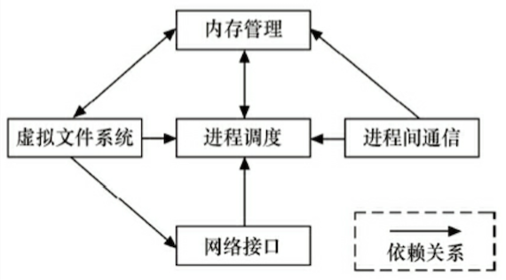

# Linux  内核

## 内核划分

## 内核的组成部分

## 内核源代码目录结构

| 目录、文件          | 说明                                       |
| -------------- | ---------------------------------------- |
| Documentation/ | 内核各部分的通用解释和注释                            |
| arch/          | 和硬件体系结构相关                                |
| block/         | 块设备驱动程序 I/O 调度                           |
| certs/         |                                          |
| crypto/        | 常用加密和散列算法（如 AES 、 SHA 等），还有一些压缩和 CRC 校验算法 |
| drivers/       | 设备驱动程序                                   |
| firmware/      |                                          |
| fs/            | 支持的各种文件系统                                |
| include/       | 头文件                                      |
| init/          | 内核初始化代码                                  |
| ipc/           | 进程间通信代码                                  |
| kernel/        | 内核部分，包括进程调度、定时器等，而和平台相关的部分在 arch/*/kernel/ |
| lib/           | 库文件                                      |
| mm/            | 内存管理，和平台相关部分在 arch/*/mm/                 |
| net/           | 网络相关，实现各种网络协议                            |
| samples/       |                                          |
| scripts/       | 用于配置内核的脚本文件                              |
| security/      | 主要是 SELinx 模块                            |
| sound/         | ALSA 、OSS 音频设备驱动核心代码和常用设备驱动              |
| tools/         |                                          |
| usr/           | 实现用于打包和压缩的 cpio 等                        |
| virt/          |                                          |
| COPYING        |                                          |
| CREDITS        |                                          |
| Kbuild         | 内核的编译系统                                  |
| Kconfig        | 给用户提供配置选择的功能                             |
| MAINTAINERS    |                                          |
| Makefile       | 定义 Linux 内核编译规则                          |
| README         |                                          |
| REPORTING-BUGS |                                          |

## 内核的编译

推荐 `make menuconfig`

- Makefile
- 配置文件（Kconfig）
- 配置工具

## 文件系统目录结构

Linux 根目录（即 “/”）

| 目录    | 说明                                      |
| ----- | --------------------------------------- |
| /bin  | 基本明命令， ls、cp、mkdir 等                    |
| /sbin | 系统命令，mod probe、hwclock、ifconfig 等       |
| /dev  | 设备文件存储目录                                |
| /etc  | 系统配置文件                                  |
| /lib  | 系统库文件存放                                 |
| /mnt  | 挂载存储设备等挂载目录                             |
| /opt  | 有些软件包安装位置                               |
| /proc | 操作系统运行时，进程及内核信息存放。伪文件系统 proc 挂载目录，存在于内存 |
| /tmp  | 临时文件                                    |
| /usr  | 存放程序目录，如用户命令、用户库等                       |
| /var  | 存放系统日志等                                 |
| /sys  | sysfs 文件系统映射目录                          |

## 文件系统与设备驱动

### udev 用户空间设备管理

- 设备和驱动分离，并通过总线进行匹配。
- udev 利用内核通过 netlink 发出的 uevent 信息动态创建设备文件节点

| 设备管理 | 说明                       |
| ---- | ------------------------ |
| udev |                          |
| mdev | udev 轻量级版本，集成于 busybox 中 |
| vold | Android 采用               |

### 

