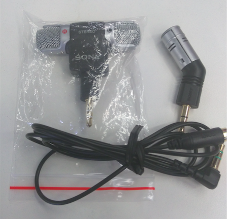
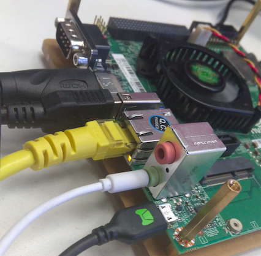

# Jetson TK1 麦克风 SONY ECM-DS70P 模块

[TOC]

TK1 MicroPhone SONY ECM-DS70P 模块实物图



## 安装

在Jetson TK1硬件上音频处，上面的粉色是话筒，下面的绿色是听筒。



若Jetson TK1的音频不能用，在终端输入以下命令即可：

```shell
amixer cset name="Stereo ADC MIXL ADC2 Switch" 0
amixer cset name="Stereo ADC MIXR ADC2 Switch" 0
amixer cset name="Int Mic Switch" 0
amixer cset name="ADC Capture Switch" 1
amixer cset name="RECMIXL BST1 Switch" 0
amixer cset name="RECMIXR BST1 Switch" 0
amixer cset name="RECMIXL BST2 Switch" 1
amixer cset name="RECMIXR BST2 Switch" 1
amixer cset name="Stereo ADC L1 Mux" "ADC"
amixer cset name="Stereo ADC R1 Mux" "ADC"
amixer cset name="Stereo ADC MIXL ADC1 Switch" 1
amixer cset name="Stereo ADC MIXR ADC1 Switch" 1
amixer cset name="Stereo ADC MIXL ADC2 Switch" 0
amixer cset name="Stereo ADC MIXR ADC2 Switch" 0
amixer cset name="IN1 Mode Control" "Single ended"
amixer cset name="IN2 Mode Control" "Single ended"
amixer cset name="Mic Jack Switch" 1
```

## 验证

1. 录音

   ```shell
   arecord demo.wav
   ```

2. 按 `Ctrl+C` 终止录音

3. 播放

   ```shell
   aplay demo.wav
   ```

另外，使用 sox 可同时录制麦克风和系统声音。

## 参考

- [Audio Input on Jetson TK1](https://devtalk.nvidia.com/default/topic/772401/audio-input-on-jetson-tk1/)
- [eGuideDog Linux 常见问题](http://www.eguidedog.net/linux-tutorial/faq.php)