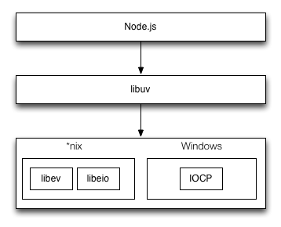
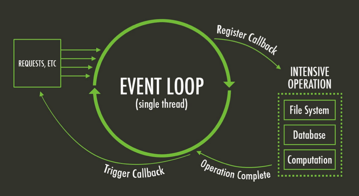

# Node.js 解析

> Node.js 嫁接了 JavaScript 生态和 C/C++ 性能与跨平台。

## Node.js

### 内部顶层组件架构概览

- Application/Modules(JS)：JavaScript 程序、Node.js 核心模块和第三方 JS 的 npm 模块
- C/C++ Binding：桥接 Node.js 核心库依赖。
- Addons：桥接自定义或第三方 C/C++ 库
- [V8](https://chromium.googlesource.com/v8/v8/)：JavaScript 引擎
- [libuv](https://github.com/libuv/libuv)：异步功能 C 库
- [其他 C/C++ 组件和库](https://nodejs.org/en/docs/meta/topics/dependencies/)： [c-ares](http://c-ares.haxx.se/)、[crypto (OpenSSL)](https://www.openssl.org/)、[http-parser](https://github.com/nodejs/http-parser) 、[zlib](http://zlib.net/)，自定义 C/C++ 组件和库等

### 语言分布

下图以 *nix 平台的 Node.js 为例：

### 运行流程

## libuv 设计图

libuv 事件循环

默认由 4 个线程来处理不同的 I/O 。

说明：Node.js 的事件驱动，在Linux 版中使用 [libev](http://software.schmorp.de/pkg/libev.html) 和 [libeio](http://software.schmorp.de/pkg/libeio.html)；在Windows 版中用的 IOCP 。

## 参考

1. [[译\] Node.js 架构概览](https://segmentfault.com/a/1190000005892501)
2. [NodeSchool](http://nodeschool.io/zh-cn)
3. [Which is correct Node.js architecture?](http://stackoverflow.com/questions/36766696/which-is-correct-node-js-architecture)
4. [libuv docs](http://docs.libuv.org/)
5. [libuv 初窥](http://blog.codingnow.com/2012/01/libuv.html)
