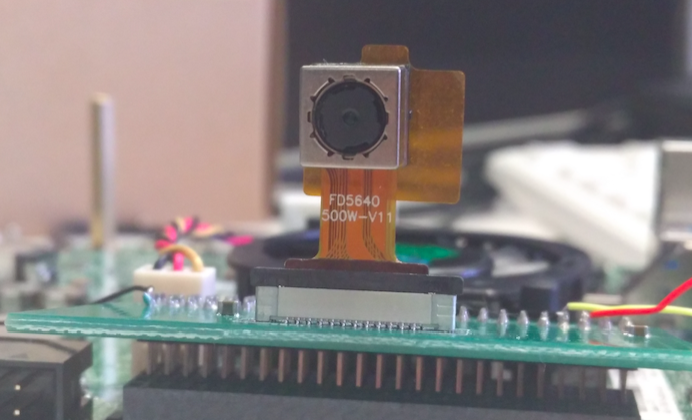
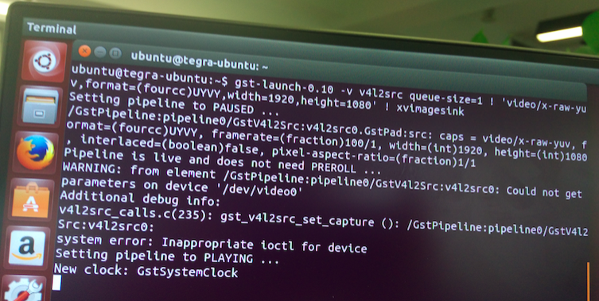

# Jetson TK1 Tegra K1 摄像头 MIPI CSI-2 模块 OV5640

模块购买，建议淘宝 [梦琪游戏资源店](https://item.taobao.com/item.htm?id=522097991891)。“卖家不光卖东西，还非常耐心细致的回答好多问题”。

TK1 Camera MIPI CSI-2 模块实物图



## 安装过程

### 准备 0

```shell
cd ~ && mkdir tegra && cd ~/tegra
wget http://developer.download.nvidia.com/embedded/L4T/r21_Release_v4.0/Tegra124_Linux_R21.4.0_armhf.tbz2
wget http://developer.download.nvidia.com/embedded/L4T/r21_Release_v4.0/Tegra_Linux_Sample-Root-Filesystem_R21.4.0_armhf.tbz2
```

[nkernel.tar.gz](http://pan.baidu.com/s/1nvdB7a5)：内核（建议联系我 或 从卖家获取），存到  `~/tegra` 目录

### 步骤 1 

```shell
sudo tar -xif Tegra124_Linux_R21.4.0_armhf.tbz2
cd Linux_for_Tegra/rootfs
sudo tar -xipf /home/ubuntu/tegra/Tegra_Linux_Sample-Root-Filesystem_R21.4.0_armhf.tbz2
```

### 步骤 2

```shell
cd ..
export LDK_ROOTFS_DIR=/home/ubuntu/tegra/Linux_for_Tegra/rootfs
sudo ./apply_binaries.sh
```

### 步骤 3

```shell
sudo apt-get install gcc-arm-linux-gnueabihf build-essential
```

### 步骤 4

```shell
cd ~/tegra
tar -xif /home/ubuntu/tegra/nkernel.tar.gz
cd nkernel/
```

### 步骤 5

```shell
ARCH=arm make tegra12_defconfig
ARCH=arm make menuconfig
```

> 如 `ARCH=arm make menuconfig` 执行失败，需 `apt-get install libncurses5-dev`
>

然后进行配置：

1.  **开启** 下面 1 项

     Device Drivers > Multimedia support > Sensors used on soc_camera driver > ov5640 camera support 

2.  **关闭**下面 2 项

     Device Drivers > Multimedia support > V4L platform devices > OV5640 camera sensor support
     Device Drivers > Graphics support > Tegra video input host1x client driver 

3.  然后保存退出

### 步骤 6

设置环境变量

```shell
export LDK_ROOTFS_DIR=/home/ubuntu/tegra/Linux_for_Tegra/rootfs/
export LDK_DIR=/home/ubuntu/tegra/Linux_for_Tegra/
```

### 步骤 7

`ln -s ~/tegra/nkernel/include/dt-bindings ~/tegra/nkernel/arm/boot/dts/include`

执行下列命令

```shell
ARCH=arm CROSS_COMPILE=arm-linux-gnueabihf- make zImage －j4
ARCH=arm CROSS_COMPILE=arm-linux-gnueabihf- make modules -j4
ARCH=arm CROSS_COMPILE=arm-linux-gnueabihf- make dtbs
sudo ARCH=arm CROSS_COMPILE=arm-linux-gnueabihf- make modules_install INSTALL_MOD_PATH=$LDK_ROOTFS_DIR
sudo cp arch/arm/boot/zImage $LDK_ROOTFS_DIR/boot
sudo cp arch/arm/boot/zImage $LDK_DIR/kernel/zImage
sudo cp arch/arm/boot/dts/tegra124-jetson_tk1-pm375-000-c00-00.dtb $LDK_DIR/kernel/dtb/
sudo cp arch/arm/boot/dts/tegra124-jetson_tk1-pm375-000-c00-00.dtb $LDK_ROOTFS_DIR/boot/
```

### 步骤 8

1. 装上 SCam-TK1 模块，usb 连接 开发机和 TK1。开发机上 执行 `lsusb` 查看是否ok。
2. 按住开发板上头的 FROC ERECOVERY 同时按下 Reset 键 进入恢复模式...确定进入恢复模式后执行下面语句，开始烧录。

```shell
cd $LDK_DIR/
sudo ./flash.sh jetson-tk1 mmcblk0p1
```

**注意事项：**注意开发机磁盘空间是否够用。预防因磁盘空间不足中断。

### 步骤 9

1. 刷完以后，登录 TK1 机器，进入开发板桌面系统


1. 执行 

   ```shell
   sudo modprobe tegra_camera
   ```

2. 至此 摄像头驱动加载完成，可以用 V4L2 访问摄像头

3. 可以用

   ```shell
   gst-launch-0.10 -v v4l2src queue-size=1 ! 'video/x-raw-yuv,format=(fourcc)UYVY,width=1920,height=1080' ! xvimagesink
   ```

命令进行测试。

**注意事项：**如 4 执行失败，可尝试是否安装以下开发库

```shell
sudo apt-get install libv4l-dev
sudo apt-get install v4l-utils
sudo apt-get install gstreamer-tools
```

## 参考

- [Gstreamer cheat sheet](http://wiki.oz9aec.net/index.php/Gstreamer_cheat_sheet#Webcam_Capture)

- [Ubuntu Video4Linux2 (v4l2) 开发库安装](http://www.mr-wu.cn/ubuntu-video4linux2-v4l2-development-library/)


## 调试

### 问题描述：

在 “步骤 9” 命令测试时，报错且卡死。



### 调试过程：

1. 确认是否内核编译过且刷成功

2. 查看dev下面有几个video 开头的设备

   ```shell
   ls /dev/video*
   ```

3. 测测 i2c 电压是否正常，正常值是 1.8

4. 拿 i2c tools 看看能扫到ID不

   ```shell
   sudo apt-get install i2c-tools
   i2cdetect -y 0
   ```

5. `lsmod` 查看都加载了哪些模块

6. 重启TK1 然后以 root 身份执行

   ```shell
   su
   echo 20 > /proc/sys/kernel/printk 
   modprobe tegra_camera
   gst-launch-0.10 -v v4l2src queue-size=1 ! 'video/x-raw-yuv,format=(fourcc)UYVY,width=1920,height=1080' ! xvimagesink
   ```


注意事项：Ubuntu 下设定 root 密码 `sudo passwd root`

