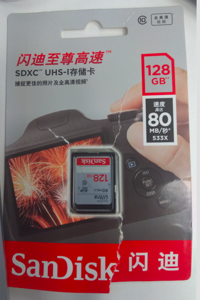
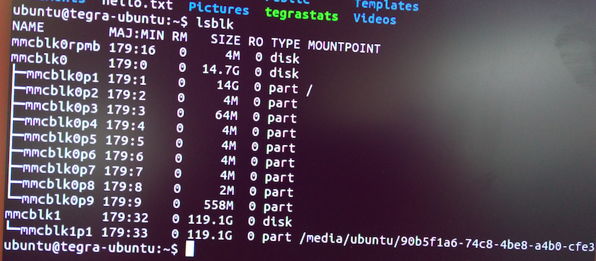
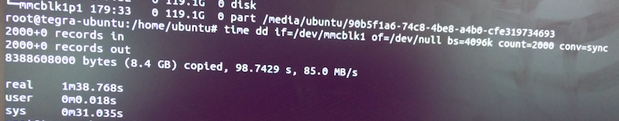
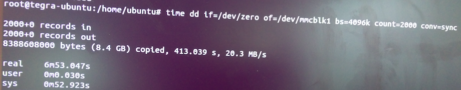

# Jetson TK1 挂载 SanDisk 128G SD 卡



## 列出块设备 0

```shell
lsblk
```



## 格式化为*ext4* 分区 1

```shell
sudo mkfs.ext4 /dev/mmcblk1p1
```

## 测试 SD 卡读写速度 2


### 磁盘读速度

```shell
time dd if=/dev/mmcblk1 of=/dev/null bs=4096k count=2000 conv=sync
```



### 磁盘写速度

```shell
time dd if=/dev/zero of=/dev/mmcblk1 bs=4096k count=2000 conv=sync
```



以上测试 2000 个 4M 块的速度，可以通过改变 bs大小来分析不同级别块的性能。

### 结论

测试环境， TK 1、Linux tegra-ubuntu 3.10.40：

| 测试数据大小       | 读速度(单位：MB/s) | 写速度(单位：MB/s) |
| ------------ | ------------ | ------------ |
| 4096k * 2    | 63.0         | 130 ～ 273    |
| 4096k * 20   | 79.6         | 22.1 ～ 102   |
| 4096k * 200  | 81.3         | 43.1 ～ 44.5  |
| 4096k * 2000 | 85.0         | 19.2 ~ 20.3  |

## 参见

- [Format SD Card as Ext4 - NVIDIA Jetson TK1](https://www.youtube.com/watch?v=78LkdgbYo1s)
- [使用 dd 命令进行硬盘 I/O 性能检测](https://linux.cn/article-6104-1.html)

