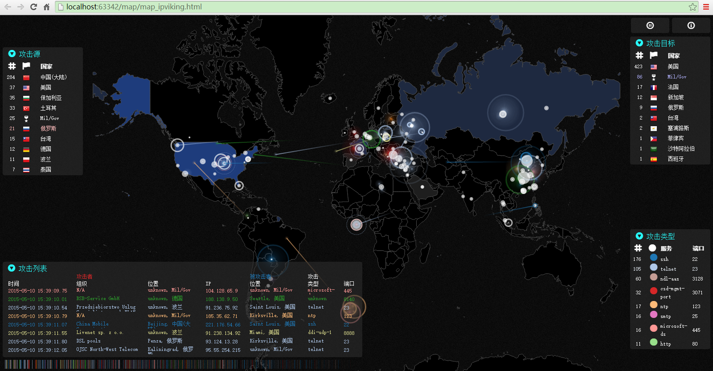
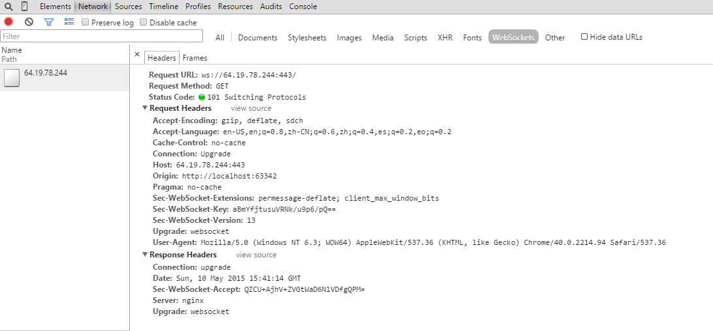
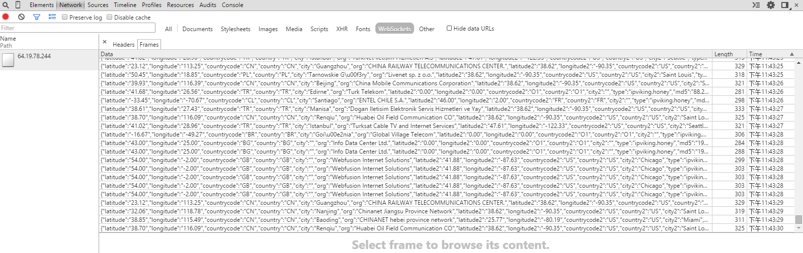

# 实时网络攻击地图 #

Realtime Attack Trackers

## 说明 ##

Demo截图

http get通讯协议 

Browser 请求示例：

    http://64.19.78.244:443/data.php?stime=1431845268&etime=1431845568

其中，

   - stime：前5分钟时刻，Unix时间戳格式。
   - etime：当前时间，Unix时间戳格式。

Server响应数据格式示例：

    [
        {
        "latitude": "30.58",                        //源纬度
        "longitude": "114.27",                      //源经度 
        "countrycode": "CN",                        //源国家地区编码，参见 country-codes.csv
        "country": "CN",                            //源国家，参见 country-codes.csv
        "city": "Wuhan",                            //源城市
        "org": "CHINANET HUBEI PROVINCE NETWORK",   //源组织
        "latitude2": "38.62",                       //目标纬度
        "longitude2": "-90.35",                     //目标经度
        "countrycode2": "US",                       //目标国家地区编码，参见 country-codes.csv
        "country2": "US",                           //目标国家，参见 country-codes.csv
        "city2": "Saint Louis",                     //目标城市
        "md5": "221.235.189.244",                   //源IP地址
        "dport": "22",                              //攻击的端口，参见port-names.tsv
        "svc": "ssh",                               //攻击类型（服务）名称，参见port-names.tsv
        },{……}
    ]

